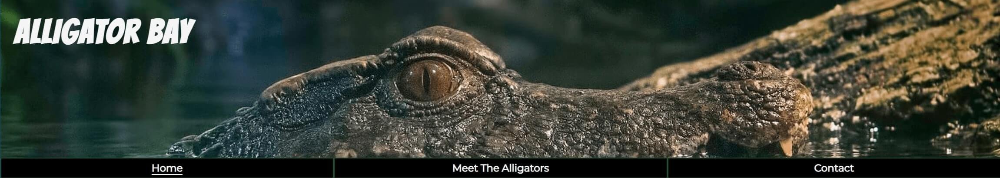

# Alligator Bay

Alligator Bay is a site for people who want to go experience seeing alligators in a safe enviornment in the Everglades, Florida.
The site is targetted towards any one that has an interested in seeing alligators, people performing with alligators and alligators getting fed.
Alligator Bay will be especially useful for tourists coming to visit the Everglades.

## Features

### Header

- __Navigation Bar__

  - A fully responsive navigation bar, that is shown on all three pages.  It has a background image with the Logo and has links to the Home page, Meet The Alligators page and the Contact page, it is identical on each page.
  - It will allow users to change to the page they need easily without having to go back to a previous page.

- __Home Page Information__

  - The first section of information on the home page shows the entry price to Alligator Bay, some information regarding alligators, what they can see at Alligator Bay and what a amenities are available.
  - This will allow users to know the price to enter and what is available on site.

- __Three Images__

   - There are three images sitting above the opening times, show times and feeding times.
   - This will help keep the user interested in the site, keeping them visually happy and interested.

- __Times Section__

  - The times section shows the user the opening times, live show times and feeding times.  
  - This will allow the user to plan for their day and when they would be able to see certain events happening before arriving.

- __Home Bottom Image__

  - A large image of an alligator that is 100% width of the page.
  - This will help keep the user interested in the site, keeping them visually happy and interested.

- __Footer__

  - A basic footer with images linking to various social networks, this is consistent across all three pages.
  - This will allow the user to keep connected via different social networking sites.

- __Our Alligators__

  - This section gives some information about the alligators and shows a video of the alligators.
  - This will give the user a visual experience of what they would come to see.

- __Alligator Facts__

  - Some information regarding facts about alligators.
  - This will give the user some information about alligators and get them more interested in coming to see them.

- __Meet The Alligators Bottom Image__

  - A large image of an alligator that is 100% width of the page.
  - This will help keep the user interested in the site, keeping them visually happy and interested.

- __Contact__

  - Contact page giving the address, contact number and a contact form for people to locate and contact Alligator Bay.
  - This will allow the user to easily find where Alligator Bay is located and contact Alligator Bay for any enquiries they may have.

- __Contact Bottom Image__

  - A large image of an alligator that is 100% width of the page.
  - This will help keep the user interested in the site, keeping them visually happy and interested.