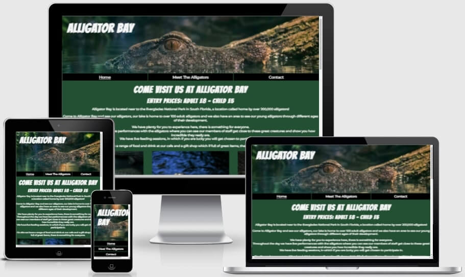

# Alligator Bay

Alligator Bay is a site for people who want to go experience seeing alligators in a safe enviornment in the Everglades, Florida.
The site is targetted towards any one that has an interested in seeing alligators, people performing with alligators and alligators getting fed.
Alligator Bay will be especially useful for tourists coming to visit the Everglades.

## Features

### Header

- __Navigation Bar__

  - A fully responsive navigation bar, that is shown on all three pages.  It has a background image with the Logo and has links to the Home page, Meet The Alligators page and the Contact page, it is identical on each page.
  - It will allow users to change to the page they need easily without having to go back to a previous page.

- __Home Page Information__

  - The first section of information on the home page shows the entry price to Alligator Bay, some information regarding alligators, what they can see at Alligator Bay and what a amenities are available.

- __Three Images__

   - There are 3 images sitting above the opening times, show times and feeding times.  This is to give the user a visual feeling on alligators, to draw their attention and help keep them interested.

- __Times Section__

  - The times section shows the user the opening times, live show times and feeding times.  This will allow the user to plan for their day and when they would be able to see certain events happening before arriving.

- __Home Image__

  - This image is to give the user a visual feeling and help keep them interested in seeing alligators.