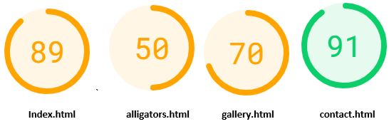

# Alligator Bay

## About

I chose to do a website on an Alligator place in the Everglades, Florida due to my own experience visiting a place when I was over there and fell in love with these magnificent creatures so I really wanted to do a website incorporating them.

## Usage

Alligator Bay was built for mobile display first, as it will work well on any sized screen upwards, rather than starting on a big screen and trying to cram all the design in to a smaller screen.
Mobile usage is now higher for internet searching than any other device, so ensuring it works perfect on that device first is most important.

Alligator Bay is a site for people who want to go experience seeing alligators in a safe enviornment in the Everglades, Florida.
The site is targetted towards any one that has an interested in seeing alligators, people performing with alligators and alligators getting fed.
Alligator Bay will be especially useful for tourists coming to visit the Everglades.

## Design

I wanted a design that matched the colours of the Everglades and gave the user a positive feedback.  I decided to use an everglade green color, as it was the obvious choice and it looked great.
For the images I wanted something that was interesting but also on the side of scary, as people are naturally scared of them but this leads people to be intrigued by them so matching the images to match this feeling was important.

I wanted it to be straight forward, a few images, short information about the place, the times of opening and activities and a contact form.
For people visiting a location they want this information easily available, they don't want to go through loads of information before realising it isn't for them.

## Features

- __Navigation Bar__

  - A fully responsive navigation bar, that is shown on all three pages.  It has a background image with the Logo and has links to the Home page, Meet The Alligators page and the Contact page, it is identical on each page.
  - It will allow users to change to the page they need easily without having to go back to a previous page.

- __Home Page Information__

  - The first section of information on the home page shows the entry price to Alligator Bay, some information regarding alligators, what they can see at Alligator Bay and what a amenities are available.
  - This will allow users to know the price to enter and what is available on site.

- __Three Images & Times Section__

  - There are three images sitting above the opening times, show times and feeding times.
  - This will help keep the user interested in the site, keeping them visually happy and interested.
  - The times section shows the user the opening times, live show times and feeding times.  
  - This will allow the user to plan for their day and when they would be able to see certain events happening before arriving.

- __Home Bottom Image__

  - A large image of an alligator that is 100% width of the page.
  - This will help keep the user interested in the site, keeping them visually happy and interested.

- __Footer__

  - A basic footer with images linking to various social networks, this is consistent across all three pages.
  - This will allow the user to keep connected via different social networking sites.

- __Our Alligators__

  - This section gives some information about the alligators and shows a video of the alligators.
  - This will give the user a visual experience of what they would come to see.

- __Alligator Facts__

  - Some information regarding facts about alligators.
  - This will give the user some information about alligators and get them more interested in coming to see them.

- __Meet The Alligators Bottom Image__

  - A large image of an alligator that is 100% width of the page.
  - This will help keep the user interested in the site, keeping them visually happy and interested.

- __Gallery__

  - Loads of images of alligators using a masonry design.
  - The images will engage the user on the site to know what they can expect to see and experience at Alligator bay.

- __Contact__

  - Contact page giving the address, contact number and a contact form for people to locate and contact Alligator Bay.
  - This will allow the user to easily find where Alligator Bay is located and contact Alligator Bay for any enquiries they may have.

- __Contact Bottom Image__

  - A large image of an alligator that is 100% width of the page.
  - The submit button has been made to look like it sits on the picture as it creates a nice flow.
  - This will help keep the user interested in the site, keeping them visually happy and interested.

## Testing

### Validator Testing

- __HTML__
  - No errors were found when checking on [w3c validator](https://validator.w3.org/nu/?doc=https%3A%2F%2Fjoshuaandrews-1882.github.io%2Fproject-1%2Findex.html).
- __CSS__
  - No errors were found when checking on [(Jigsaw) validator](http://jigsaw.w3.org/css-validator/validator?uri=https%3A%2F%2Fjoshuaandrews-1882.github.io%2Fproject-1%2Findex.html&profile=css3svg&usermedium=all&warning=1&vextwarning=).
  - No errors of concern were found when checking on [Code Beautify CSS validator](https://codebeautify.org/cssvalidate).

### Page Speed

#### Tested Mobile and Desktop Speed on [PageSpeed Insights](https://developers.google.com/speed/pagespeed/insights/)

- __Mobile__

  - Lower speed caused by image format and the video being embedded from YouTube.

- __Desktop__

  - Lower speed caused by image format and the video being embedded from YouTube.

### Personal Check
  - Used a PC, tablet and a mobile to click on the different links and the videos and all worked ok.

### Unfixed Bugs

- There are no known bugs in the code.

## Deployment

- __The website was deployed on GitHub pages, it is done as followed:__

  - In the repository for the website to be published, click on settings.
  - Click on the pages tab.
  - In Source change the branch to master, ensure root is selected next to it and then click save.
  - A link will appear for your website, wait a few minutes and refresh, it should be ready.
  - If it says ready but still not loading then wait a little longer, it will eventually load.

The link for this site is as followed - https://joshuaandrews-1882.github.io/project-1/index.html

## Credits

### Content

- A guide on how to make the content responsive for different sized screens was taken from [Eugenio on YouTube](https://www.youtube.com/channel/UCdPMJB0w--p9xrlvFeYz5wA).
- Instructions for a reponsive contact form was taken from [w3schools](https://www.w3schools.com/howto/howto_css_responsive_form.asp).
- The icons for the footer were taken from [Font Awesome](https://fontawesome.com/).
- Instructions to space the social media icons was taken from the Love Running project by [Code Institute](https://codeinstitute.net/).
- Instructions to do the gallery was taken from the Love Running project as it suited my different sized pictures, the Love Running project is by [Code Institute](https://condeinstitute.net/).
- For fonts I used [Google Fonts](https://fonts.google.com/).

### Media

- The photos used on this site were taken from [Unsplash](https://unsplash.com/)
- The photos used in the gallery are my own personal photos.
- The video in the Meet the Alligator section is my own personal video.